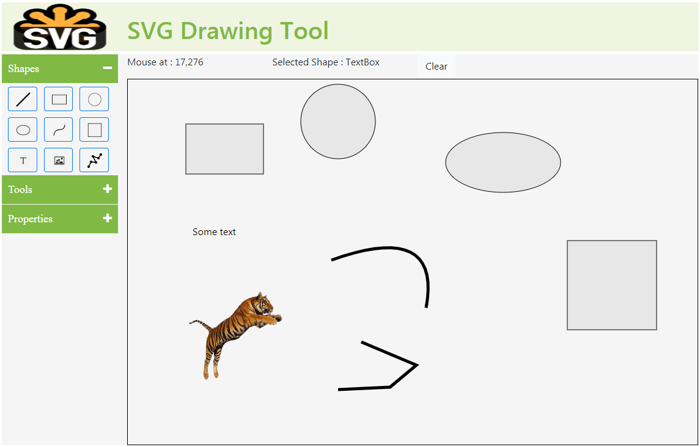

# svg-drawing-tool
Draw SVG shapes with Angular 6

The SVG Drawing Tool is a web based tool to draw different kind of shapes like line, circle, rectangle, square, text and images.

How it Works
============
Select a shape from the shape menu (line, circle) and click somewhere in the graphical space of the svg. Hold down the mouse and drag the shape to match its size. If you want to move a shape click on it and move the shape while holding down the mouse. Move to the new location. Shapes like line, polygon can not be moved.

If drawing PolyGon select the point by mouse click. When finished select the Pointer tool from the tools menu.

In the properties menu you can select the stroke color and width. Also you can sit the fill color for the shape.

TODO
====
1. Implement property inspector for each shape i.e. line, circle, rectangle etc.
2. Implement Path component.
3. Save svg to disk
4. Apply property settings to style sheets.
5. Resize components
6. Group shapes

Below is a screenshot how the app looks.

